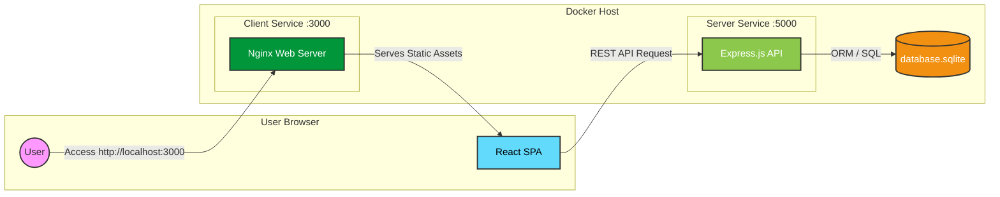

# FreightSync

**FreightSync** is a secure, containerized freight marketplace application. It connects shippers with fleet managers, enabling load creation, bidding, and shipment tracking with OTP verification.

## 🚀 Live Demo Deployment

**Public URL**: Passed in `deployment.txt` (via Ngrok tunnel).
> Please refer to `deployment.txt` in the submission folder for the active public link.

1.  Open the link provided in `deployment.txt`.
2.  Use the credentials below to log in.

---

## 🧪 Demo Credentials

| Role | Email | Password |
| :--- | :--- | :--- |
| **Shipper** | `shipper@test.com` | `1234` |
| **Fleet** | `fleet@test.com` | `1234` |
| **Driver** | `driver@test.com` | `1234` |

---

## 📋 Project Analysis

### Criterion: Description

**FreightSync** is a full-stack digital logistics platform designed to replace manual freight negotiation with a transparent, automated marketplace. It solves the core problem of connecting Shippers (who have cargo) with Fleet Managers (who have trucks) and Drivers (who execute the job) in a unified, real-time system.

### Solution Quality: Clarity and Effectiveness
The solution provides a clean, role-based interface where each user type has a distinct workflow:
*   **Shippers** post loads and review bids.
*   **Fleets** view available loads and place bids.
*   **Drivers** receive assignments and verify deliveries via OTP.
This separation of concerns minimizes friction and ensures that users only see what is relevant to their role, effectively creating a structured digital handshake for logistics.

### Impact: Real-world Usefulness
In the real world, freight coordination often relies on fragmented phone calls and emails, leading to delays and fraud. FreightSync impacts this domain by:
*   **Preventing Fraud**: Implements strict "Shipper Spoofing Prevention" ensuring loads are cryptographically tied to the creator.
*   **Verifying Execution**: Uses OTP (One-Time Password) verification at the point of delivery, providing cryptographic proof that the driver physically met the receiver.
*   **Reducing Latency**: Real-time bidding allows loads to be covered in minutes rather than hours.

### Reliability: Stability and Correctness
The system is engineered for stability under pressure:
*   **DDoS Protection**: Enforces 10kb payload limits and strict rate limiting (3 OTP attempts/min) to prevent abuse.
*   **Containerized Stability**: Runs on a Dockerized architecture ensuring consistent behavior across dev, test, and production environments.
*   **Error Handling**: Production-grade error masking hides internal database schemas from potential attackers while logging details internally for debugging.

### Technical Alignment: Architecture and Tech Choices
The architecture follows industry best practices for modern web applications:
*   **Microservice-Ready**: Decoupled Client (React/Vite) and Server (Node/Express), served via Nginx.
*   **Security-First**: Uses strong 256-bit JWT secrets and `helmet` headers.
*   **Infrastructure as Code**: Entire stack is defined in `docker-compose.yml` for reproducible deployments.

---

## 🏗️ Architecture Diagram



## 🚀 Quick Start

### Prerequisites
- Node.js (v16 or higher)
- npm

### 1. Start the Server
```bash
cd server
npm install
npm run dev
```
The server will run on [http://localhost:5000](http://localhost:5000).

### 2. Start the Client
Open a new terminal:
```bash
cd client
npm install
npm run dev
```
The application will run on [http://localhost:5173](http://localhost:5173) (or similar).

---
